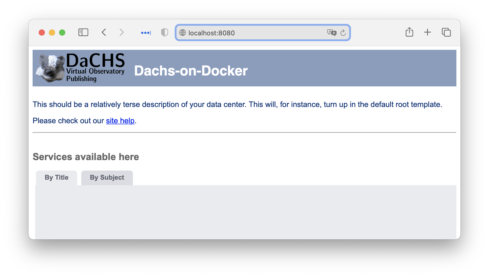

# DaCHS on Docker
[](https://app.travis-ci.com/gavodachs/docker-dachs)

> ###### Update:
> Recently the Dachs-on-Docker images repository -- on DockerHub -- have been
> changed from `chbrandt` to `gavodachs`organisation.
> The documentation is being reviewed and updated accordingly, but if/whenever
> you see a `chbrandt/dachs`, read, change it to `gavodachs/dachs`.

Here you'll find recipes for building and running [GAVO DaCHS](http://docs.g-vo.org/DaCHS/)
in Docker containers (https://hub.docker.com/u/gavodachs).

ToC:

- [Quick Dachs](#quick-dachs)
    1. [Run a published image](#run-a-published-image)
    1. [Build your own image](#build-your-own-image)
    1. [Container flavors](#container-flavors)


## Quick Dachs
DaCHS _service_ is composed by two daemons: PostgreSQL and the Dachs _server_.
Postgres stores the data, while Dachs-server interfaces the user (web, api) and
manages the astro/planetary data accordingly.
By default, Dachs provides its (api) endpoints at port `8080` on `localhost`.

> For fine details about DaCHS, refer to the official docs: [soft.g-vo.org](https://soft.g-vo.org/dachs).


### Run a published image
If all you wanna do now is to see _Dachs-on-Docker_ running:

```bash
[~/]$ docker run -it -p 8080:8080 --name dachs gavodachs/dachs
```

Which should print a help/intro message like the following, and land you in a terminal session _inside_ the container:

```
==========================================================
This image provides dachs & postgresql bundled together,
same scenario as you would have if installed the package,
gavodachs-server, on your own linux box

To start DaCHS (and Postgres), type:
--------------------
 $ /dachs.sh start
--------------------
It is just a convenience script to start/stop the services.
See its '--help' for further information about its usage.


After starting DaCHS, you should see it working at:
 - http://localhost[:8080]


Use 'gavo/dachs' as usual:
--------------------
 $ dachs --help
--------------------
DaCHS documents are available at:
 - http://dachs-doc.rtfd.io/tutorial.html


DaCHS version: 2.7.3
PSQL version: 13.11
==========================================================

root@a3035ad36500:/$
```

At this point, you can run and use DaCHS as you would in any "normal" operating system.
For instance, you can start DaCHS and PostgreSQL in _debug_ mode:

```bash
root@a3035ad36500:/$ service postgresql start
Starting PostgreSQL 13 database server: main.
root@a3035ad36500:/$
root@a3035ad36500:/$ dachs serve debug
<date> [-] Log opened.
<date> [-] Site starting on 8080
<date> [-] Starting factory <twisted.web.server.Site object at 0x7fb33c844fd0>
Starting VO server: dachs.
(...)
```

Or -- as per the help message (above) -- you can start Dachs service with `/dachs.sh start`:

```bash
root@a3035ad36500:/$ /dachs.sh start
13/main (port 5432): down
Starting PostgreSQL 13 database server: main.
Starting VO server: dachs.
root@a3035ad36500:/$ 
```

Docker `run` will instantiate the container and hand you a bash session from inside the container.
Then we start Postgres to finally start Dachs (in `debug` mode to have it verbose).

> The `/dachs.sh` you will find in the container is a simple script to start/stop
> the servers for your convenience (eg, `/dachs.sh start` will do the above steps).


You go to [http://localhost:8080](http://localhost:8080) and you should see Dachs frontpage:




### Build your own image
On the other hand, if you want to build your own iamge (the latest `dachs` image), you'll do:

```bash
[~/]$ cd dockerfiles
[~/dockerfiles]$ docker build -t my_dachs dachs/
(...)
=> => exporting layers
=> => writing image sha256:ddb02867...
=> => naming to docker.io/library/my_dachs
```

This will create a new image -- `my_dachs` -- for you (you can check it with `docker images`).
You can then run `my_dachs` as we did before in "[Run a published image](#run-a-published-image)".

> For more details on _building_ images, go to [dockerfiles/README.md](dockerfiles/README.md)


### Container flavors
The containers are built on top of Debian Bullseye image, which GAVO/DaCHS package
is part of the _main_ (and _backports_) repository (current Dachs version: 2.3).
For the `latest` images we use also GAVO repositories, where updates go first (current Dachs version: 2.5).

There are three images in our context: `dachs`, `server`, `postgres`.
Those three images are to provide two different running setup:
using just one image, `dachs`, like we just did;
Or as a pair of containers, `postgres` and (dachs) `server`, talking to each other.

The single-container setup:

- `gavodachs/dachs[:tag]` provides a "one-shot" solution for having
Dachs running in its simple; Dachs-server and Postgres run inside
the same container.

The other two images provide Dachs and Postgres in their individual containers:

- `gavodachs/server[:tag]` provides gavodachs-server, depends on `postgres`.
- `gavodachs/postgres[:tag]` provides PostgreSQL for use by _dachs-server_.

  > How to run `server`/`postgres` is covered in page
    ['individual_containers.md'](docs/individual_containers.md).


#### Tags
The tags reflect the _apt_ repositories set up in there:

- `latest`,`gavo`: uses all repositories (Debian and Gavo)
- `backports`: uses all _Debian_ repositories
- `main`: uses only Debian's `stable/main`

> See [`etc/apt_sources.list`](dockerfiles/dachs/etc/apt_sources.list) for the
> actual list of repositories used (they are enabled-or-not during the building of
> the image, according to _building arguments_).

Check the documents directory ([docs/](docs/)) for more content.

---


/.\
