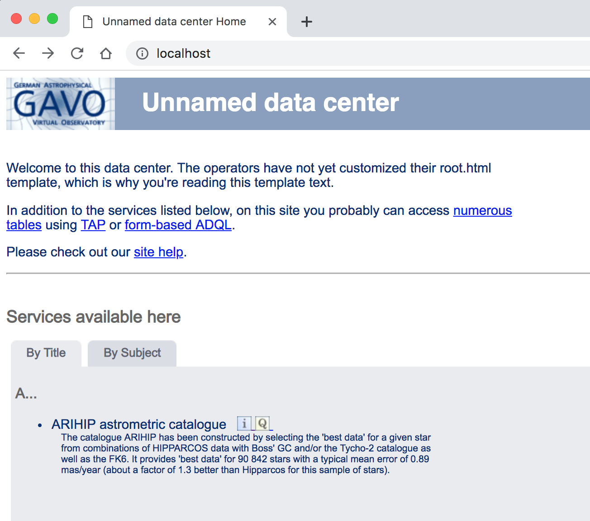

# Upgrading Dachs on Docker containers

In this tutorial we will go through a version upgrade of Dachs/Postgres holding
on the publishing services, persisting the data and minimizing the downtime.

> Some steps in this tutorial were already covered in the [README],
> [Data Persistence](_Data_Persistence), or [Workflow](_Workflow) documents
> and details will not be repeated here. Please make sure any doubt is
> satisfied by those documents and if something remains unclear, let us know.

Here we will
* start from the ARIHIP example using DaCHS v0.9.6,
* then detach the data from the main container,
* upgrade the Postgres database to v9.6,
* upgrade the Dachs server to v1.2,
* finally, check services.

> DaCHS version `v0.9.6` is going to be used because effectively that was the
> version _Dachs-on-Docker_ (DoD) started, and remained there until recently when
> people started using it and asked for updates -- when DoD jumped to `v1.2`.

## Dachs v0.9.6

We start with the old version of DaCHS and the classic ARIHIP example; the
process we are going through _should_ be the same when handling multiple
data sets (if not, please let us know).

* Instanciate the containers:
```bash
(host)$ docker run -dt --name postgres chbrandt/dachs:postgres-9.4
(host)$ docker run -dt --name dachs --link postgres -p 80:80 chbrandt/dachs:server-0.9.6
```

* Add data:
```bash
(host)$ mkdir -p arihip/data
(host)$ curl http://svn.ari.uni-heidelberg.de/svn/gavo/hdinputs/arihip/q.rd -o arihip/q.rd
(host)$ curl http://dc.g-vo.org/arihip/q/cone/static/data.txt.gz -o arihip/data/data.txt.gz
(host)$ docker cp arihip dachs:/var/gavo/inputs/.
(host)$ docker exec -it dachs bash -c 'gavo imp arihip/q && gavo pub arihip/q'
(host)$ docker exec dachs bash -c 'gavo serve reload'
(host)$ rm -rf arihip
```
<div>
  <p>This is what we should see in our http://localhost:</p>
  
</div>


## Detach data from the Dachs container

What we want to do now is to detach the data from the dachs container.
But when the container is running we cannot associate volumes to it.
To do so we have to stop first stop the container and then restart it with the
associated volume.

* Save the current container state:
```bash
(host)$ docker commit --pause dachs dachs_arihip:tmp
(host)$ docker stop dachs
(host)$ docker rm dachs
(host)$ docker volume create dachs_data
(host)$ docker run -dt --name dachs --link postgres -p 80:80 \
        --volume dachs_data:/var/gavo/inputs dachs_arihip:tmp
```

At this point, the service should be running just like before.
In fact, if we go to http://localhost we will/should see DaCHS web page, and the
ARIHIP dataset published.

I feel like two notes are worth making now:

> What happened when we included the `dachs_data` volume was that the data in
> `/var/gavo/inputs` was copied to the (then empty) volume. This was transparent
> to us, and it is so by design (https://docs.docker.com/storage/volumes/#populate-a-volume-using-a-container).

> The same scenario could have been reached from the beginning by using a
> "dachs_data" volume when we first started the `dachs` container in section
> [#Dachs-v0.9.6], and then importing the (ARIHIP) data. We did split the
> workflow here to present a common case where users will indeed have datasets
> already inside the (one) container before realizing their data is inprisoned
> inside it.
